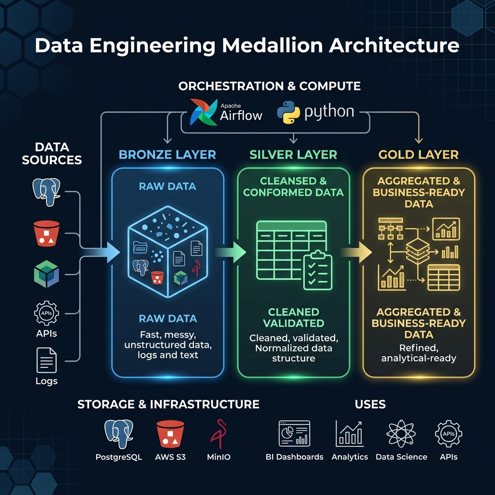

# Stock Market Intelligence Platform

An end-to-end data engineering and analytics project designed to transform raw financial data into actionable insights. This project guides users through building a robust automated pipeline that ingests historical and real-time stock market data from public APIs, cleans and processes this time-series data, and provides an interactive front-end dashboard to explore market trends and AI-driven insights.


## Why We Built This

The financial markets can seem intimidating and overly complex for everyday individuals. We built this platform with a clear mission: **to democratize financial data and help everyday people learn how to trade stocks effectively.** 

By providing an intuitive interface backed by professional-grade data engineering, we aim to:

- **Empower Beginners**: Break down complex market concepts into understandable, actionable insights so anyone can learn the fundamentals of trading without feeling overwhelmed.
- **Enable Profitable Decisions**: Equip users with the same quality of real-time data, historical trends, and AI-driven intelligence that professionals use. We want to help people make informed trades and successfully grow their wealth.
- **Provide Accessible Tools**: Remove the paywalls often associated with high-quality financial analysis platforms, offering a comprehensive suite of tools completely free of charge.
- **Promote Financial Literacy**: Help users understand the "why" behind market movements through our AI assistant and detailed analytics, turning speculative guesses into educated investments.

## Core Idea

The goal of this project is to create a complete ecosystem for financial data analysis. It leverages the Medallion Architecture (Bronze, Silver, Gold layers) to progressively process raw market data into high-quality, query-ready datasets. 

The architecture ensures data reliability, scalability, and performance, providing a solid foundation for the interactive web application that offers real-time quotes, technical charts, historical data analysis, and intelligent market insights.

## System Architecture



The project is split into three main pillars:

1. **Data Engineering Pipeline**: Orchestrated by Apache Airflow, scripts extract data using yfinance, storing raw data in the Bronze layer, transforming it in the Silver layer, and aggregating it for business readiness in the Gold layer (utilizing S3 and MinIO).
2. **Backend Services**: A FastAPI application providing secure REST endpoints. It manages user sessions via Supabase, serves real-time and historical market data, and powers a custom AI assistant.
3. **Frontend Dashboard**: A responsive, dark-mode web application built with Next.js and React. It features lightweight interactive charts and a comprehensive suite of tools for tracking stocks, viewing sectors, and reading insights.

## Features

Here is a closer look at the platform's core features:

### Interactive Financial Charts
Candlestick and line charts built with Recharts and Lightweight Charts allow users to perform technical analysis effortlessly.


### AI Assistant Integration
A built-in chat interface for querying market intelligence. Users can ask questions about stock performance or trading strategies.


### Personalized Watchlists
Users can track their favorite tickers, view performance at a glance, and monitor their customized portfolio.


### Real-Time Data & Insights
Live market quotes and up-to-date historical trends, alongside a dedicated Insights page for the latest market news.


### User Authentication
Secure login and registration powered by Supabase, ensuring user data and preferences are safely stored.


- **Automated Data ELT**: Scheduled Airflow DAGs for daily, hourly, and master data ingestion.
- **Medallion Data Lake**: Structured storage on S3 and MinIO (Bronze, Silver, Gold).

## Technology Stack

**Data Engineering**
- Apache Airflow
- Python (Pandas, PyArrow, yfinance)
- Object Storage (AWS S3, MinIO)
- PostgreSQL

**Backend**
- FastAPI
- Uvicorn
- SQLAlchemy and Pydantic
- Supabase (Authentication)

**Frontend**
- Next.js (React 19)
- TypeScript
- Lightweight Charts and Recharts
- CSS Modules

## Project Structure

```text
Stock-Market/
├── backend/                  # FastAPI application and routing
├── frontend/                 # Next.js web application
├── dags/                     # Apache Airflow DAG definitions
├── bronze_layer_scripts/     # Raw data extraction scripts
├── silver_layer_scripts/     # Data cleaning and normalization
├── gold_layer_scripts/       # Aggregation and business logic
├── docs/                     # Documentation and architecture diagrams
├── docker-compose.yml        # Multi-container orchestration
└── README.md                 # Project documentation
```

## Getting Started

### Prerequisites

- Docker and Docker Compose
- Node.js (v20 or higher)
- Python 3.10 or higher

### Setup Instructions

1. **Start the Data Infrastructure**
   Initialize Airflow, MinIO, and PostgreSQL using Docker Compose:
   ```bash
   docker-compose up -d
   ```
   Access the Airflow web interface at http://localhost:8080 (Default credentials: admin / admin).

2. **Run the Backend API**
   Navigate to the `backend` directory, install dependencies, and start the FastAPI server:
   ```bash
   cd backend
   python -m venv .venv
   source .venv/bin/activate
   pip install -r requirements.txt
   uvicorn main:app --reload
   ```
   The API will be available at http://localhost:8000.

3. **Run the Frontend Application**
   Navigate to the `frontend` directory, install Node dependencies, and start the Next.js development server:
   ```bash
   cd frontend
   npm install
   npm run dev
   ```
   The web application will be available at http://localhost:3000.

## License

This project is licensed under the terms of the MIT License. Please refer to the LICENSE file for details.
